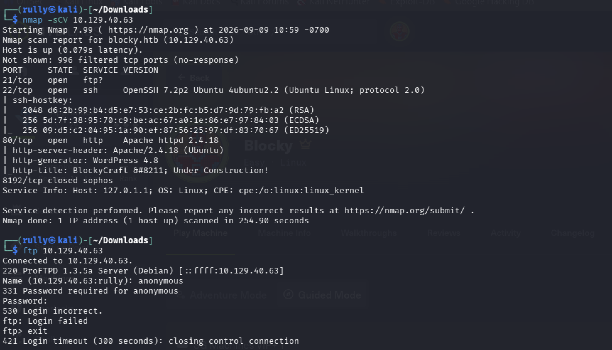
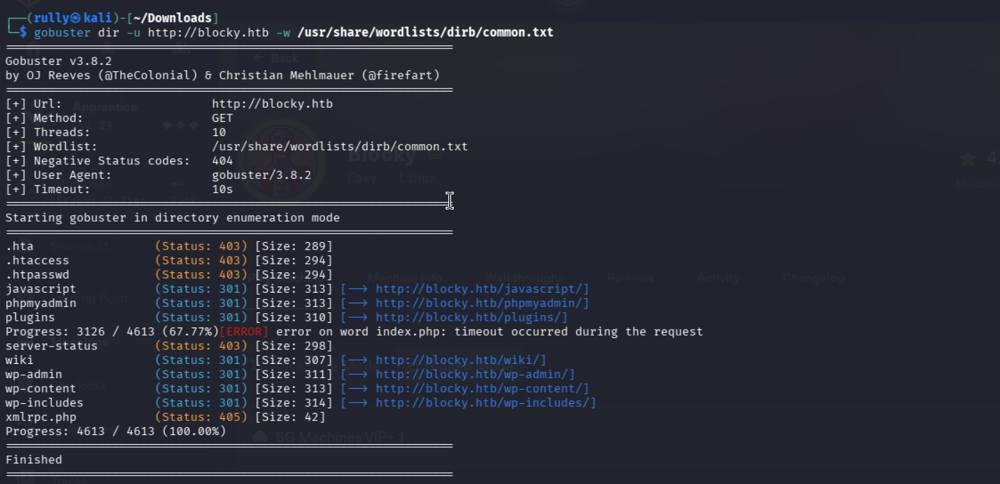
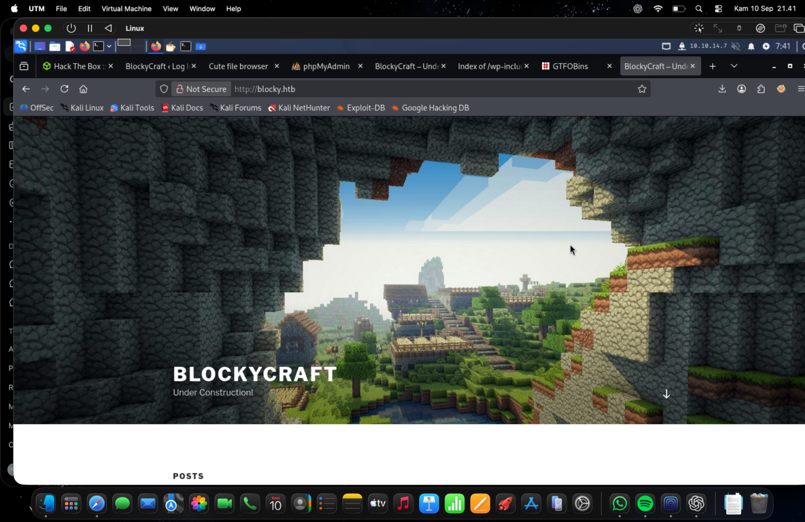
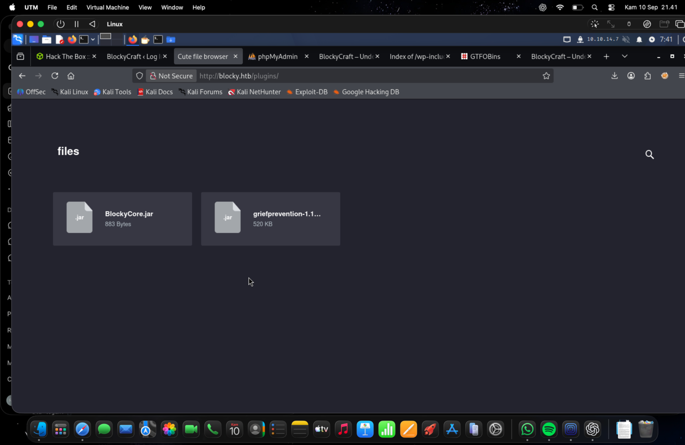
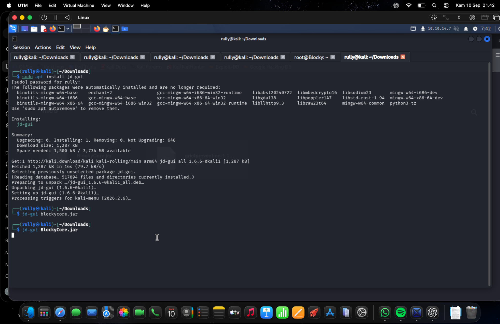
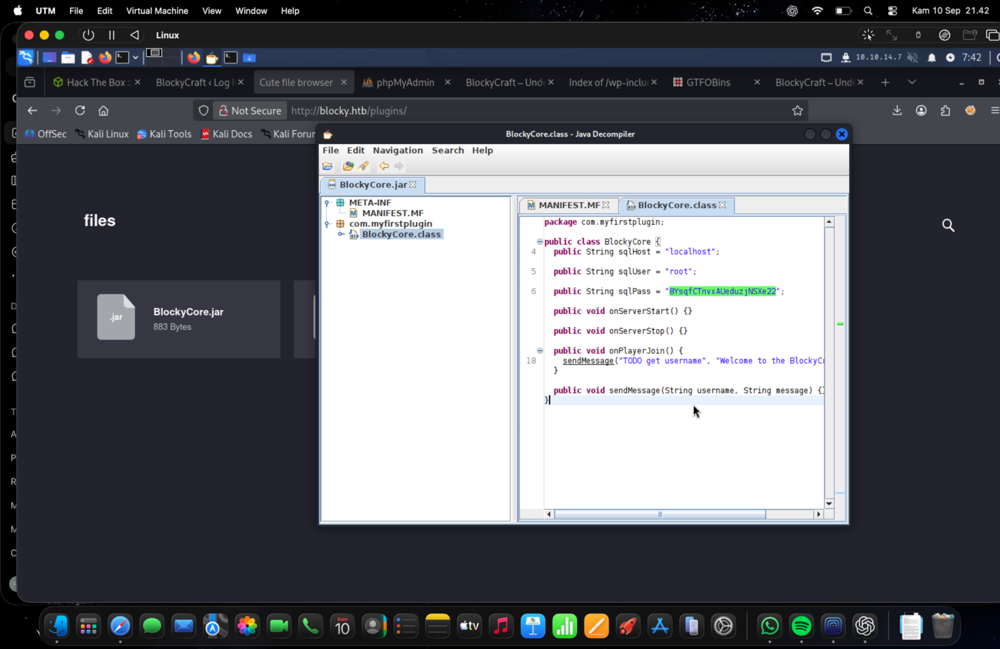
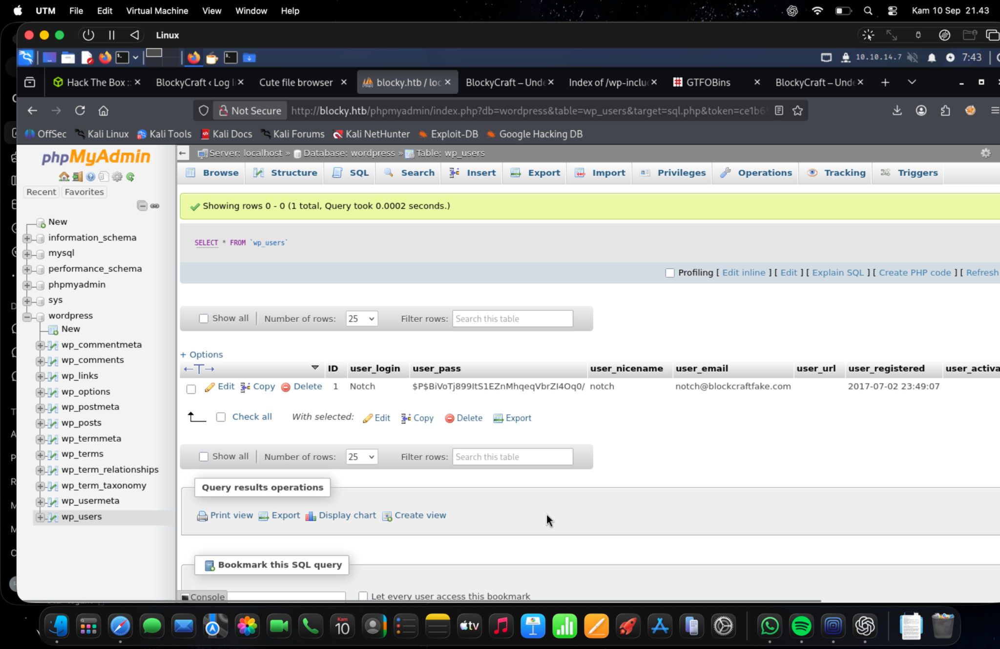
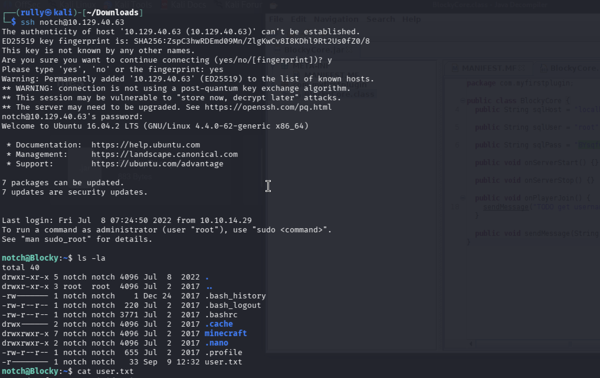
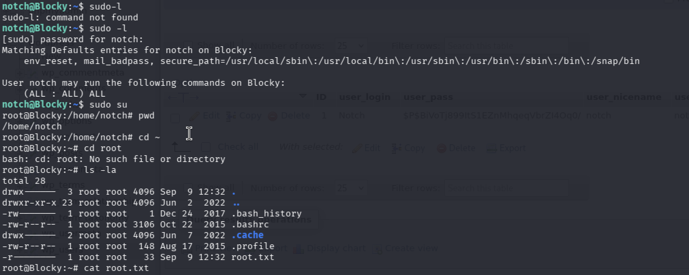

# Hack The Box — Blocky Writeup

**Author:** Rully Miftahur Rozaq  
**Platform:** Hack The Box  
**Machine:** Blocky  
**Difficulty:** Easy  
**Operating System:** Linux  
**Completion date:** 10 September 2026

## Executive Summary

This writeup documents the compromise of the Hack The Box **Blocky** machine. Initial enumeration identified FTP, SSH, and an Apache-hosted WordPress site. Directory discovery exposed a `/plugins/` directory containing downloadable Java archives. Decompiling `BlockyCore.jar` revealed hard-coded MySQL credentials. The database interface exposed the WordPress username `Notch`, and password reuse allowed the database password to authenticate the same account over SSH. Finally, unrestricted `sudo` privileges allowed the user to start a root shell.

The main attack path was:

```text
Service enumeration
    -> Exposed /plugins/ directory
    -> Downloadable BlockyCore.jar
    -> Hard-coded database credentials
    -> WordPress username discovery
    -> SSH password reuse
    -> Unrestricted sudo privileges
    -> Root access
```

## Scope and Authorization

This assessment was performed against the **Blocky** machine inside the Hack The Box controlled CTF environment. The target address was a temporary lab address assigned by the platform. The techniques documented here must only be used on systems for which explicit authorization has been granted.

## Testing Environment

| Item | Value |
| --- | --- |
| Attacker system | Kali Linux running in UTM |
| Target | `10.129.40.63` / `blocky.htb` |
| Target OS | Ubuntu Linux |
| Main tools | Nmap, FTP client, Gobuster, Firefox, JD-GUI, phpMyAdmin, SSH, sudo |

## 1. Reconnaissance and Service Enumeration

I started by running an Nmap default-script and service-version scan against the target:

```bash
nmap -sCV 10.129.40.63
```

The options used were:

- `-sC`: runs Nmap's default NSE scripts.
- `-sV`: attempts to identify the version of each detected service.

The scan identified the following relevant ports:

| Port | Service | Observed information |
| --- | --- | --- |
| `21/tcp` | FTP | ProFTPD 1.3.5a was shown after connecting |
| `22/tcp` | SSH | OpenSSH 7.2p2 Ubuntu |
| `80/tcp` | HTTP | Apache 2.4.18 with WordPress 4.8 |

The HTTP title was `BlockyCraft – Under Construction!`, which confirmed that the main attack surface was likely the web application. I also tested anonymous FTP access:

```bash
ftp 10.129.40.63
```

The server rejected the anonymous login with `530 Login incorrect`, so FTP did not provide an immediate foothold.



*Figure 1 — Nmap identified FTP, SSH, and HTTP; anonymous FTP authentication failed.*

## 2. Web Directory Enumeration

I used Gobuster with the DIRB common wordlist to discover accessible paths:

```bash
gobuster dir -u http://blocky.htb -w /usr/share/wordlists/dirb/common.txt
```

Several useful endpoints were discovered:

| Path | Status | Relevance |
| --- | --- | --- |
| `/phpmyadmin/` | `301` | Exposed database administration interface |
| `/plugins/` | `301` | Directory containing downloadable Java archives |
| `/wiki/` | `301` | Additional web content |
| `/wp-admin/` | `301` | WordPress administration area |
| `/wp-content/` | `301` | WordPress content directory |
| `/wp-includes/` | `301` | WordPress core resources |
| `/xmlrpc.php` | `405` | WordPress XML-RPC endpoint present |

A timeout occurred while Gobuster requested `index.php`, but the scan continued and completed. This did not prevent discovery of the important directories.



*Figure 2 — Gobuster exposed `/phpmyadmin/`, `/plugins/`, and several WordPress paths.*

## 3. Web Application Inspection

Opening `http://blocky.htb` displayed the BlockyCraft WordPress site. The page itself contained little interactive functionality, so the directories found through Gobuster became the next priority.



*Figure 3 — The BlockyCraft WordPress site was under construction.*

Browsing to `/plugins/` revealed two downloadable JAR files:

- `BlockyCore.jar`
- `griefprevention-1.11...jar`

The custom file `BlockyCore.jar` was especially interesting because custom application code frequently contains implementation details, internal endpoints, or embedded secrets.



*Figure 4 — Directory listing exposed the custom `BlockyCore.jar` plugin.*

## 4. Decompiling the Java Plugin

After downloading `BlockyCore.jar`, I installed JD-GUI and attempted to open the archive:

```bash
sudo apt install jd-gui
jd-gui blockycore.jar
jd-gui BlockyCore.jar
```

The first filename did not match the archive's capitalization. Because Linux filenames are case-sensitive, I corrected it to `BlockyCore.jar`.



*Figure 5 — JD-GUI was installed and the correctly capitalized JAR filename was opened.*

Inside `com.myfirstplugin.BlockyCore`, the decompiled class contained three database configuration fields:

```java
public String sqlHost = "localhost";
public String sqlUser = "root";
public String sqlPass = "<REDACTED_LAB_PASSWORD>";
```

This was a hard-coded credential vulnerability. Anyone able to download and decompile the archive could recover the database account and password without authenticating to the application.



*Figure 6 — Decompiled application code disclosed the MySQL root username and password. The password is not transcribed in this report.*

## 5. WordPress User Discovery

The exposed `/phpmyadmin/` interface was accessible with the database credentials recovered from the JAR. In the `wordpress` database, the `wp_users` table contained one relevant account:

| Field | Observed value |
| --- | --- |
| `user_login` | `Notch` |
| `user_nicename` | `notch` |
| `user_email` | `notch@blockcraftfake.com` |
| `user_pass` | WordPress password hash present; not transcribed |

This established a valid system username candidate. Instead of relying on the WordPress hash, I tested whether the hard-coded database password had been reused by the `notch` account.



*Figure 7 — The `wp_users` table disclosed the username `Notch`.*

## 6. Initial Foothold Through SSH

I attempted to authenticate to SSH as `notch`:

```bash
ssh notch@10.129.40.63
```

The database password recovered from `BlockyCore.jar` was accepted for the `notch` account. This confirmed password reuse between the application/database configuration and the operating-system account.

After logging in, I listed the home directory and located `user.txt`:

```bash
ls -la
cat user.txt
```

The screenshot confirms an interactive shell as `notch@Blocky` and the presence of the user flag file. The flag value is intentionally omitted.



*Figure 8 — Reused credentials provided SSH access as `notch`; `user.txt` was located in the home directory.*

## 7. Privilege Escalation

I checked the account's sudo permissions. The first attempt contained a syntax mistake:

```bash
sudo-l
```

This returned `command not found` because the command and option were written without a space. I corrected it to:

```bash
sudo -l
```

The result showed:

```text
User notch may run the following commands on Blocky:
    (ALL : ALL) ALL
```

This rule allowed `notch` to execute any command as any user or group after supplying the account password. I used the observed command below to start a root shell:

```bash
sudo su
```

The prompt changed from `notch@Blocky` to `root@Blocky`, confirming successful privilege escalation. I then moved to root's home directory and located the root flag:

```bash
pwd
cd ~
ls -la
cat root.txt
```

An intermediate `cd root` attempt failed because `cd ~` had already moved the shell to `/root`; therefore, `cd root` incorrectly referred to `/root/root`. This did not affect access.



*Figure 9 — The unrestricted sudo rule allowed a root shell, and `root.txt` was located in `/root`.*

## 8. Findings

### Finding 1 — Publicly Exposed Application Archive

The `/plugins/` directory allowed unauthenticated users to download a custom application archive. This exposed internal application logic to analysis.

**Recommendation:** Disable directory listing, remove development artifacts from the web root, and restrict access to files that are not intended for public distribution.

### Finding 2 — Hard-Coded Database Credentials

The custom Java class stored the MySQL root password directly in its source code. Decompilation therefore revealed a privileged database credential.

**Recommendation:** Store secrets outside application packages, use a dedicated least-privileged database account, and rotate any credential exposed in distributed code.

### Finding 3 — Password Reuse Across Services

The database password also authenticated the `notch` operating-system account over SSH. One disclosed secret therefore compromised both the application data and the host.

**Recommendation:** Use unique credentials for every service, disable password-based SSH authentication where possible, and prefer managed secrets plus SSH keys.

### Finding 4 — Excessive Sudo Privileges

The `notch` account could execute every command as any user through sudo. Compromise of this account immediately resulted in total system compromise.

**Recommendation:** Apply least privilege and allow only explicitly required commands. Avoid broad rules such as `(ALL : ALL) ALL` for non-administrative service or application users.

## 9. Command Reference

| Command | Purpose |
| --- | --- |
| `nmap -sCV 10.129.40.63` | Run default scripts and detect service versions |
| `ftp 10.129.40.63` | Test FTP access, including anonymous authentication |
| `gobuster dir -u http://blocky.htb -w ...` | Enumerate common web directories and files |
| `sudo apt install jd-gui` | Install the Java decompiler |
| `jd-gui BlockyCore.jar` | Open and decompile the exposed Java archive |
| `ssh notch@10.129.40.63` | Attempt remote login as the discovered user |
| `sudo -l` | List commands the current user may run with sudo |
| `sudo su` | Start a root shell using the permitted sudo access |

## 10. Lessons Learned

- Custom application files exposed through directory listing should be reviewed before attempting more complex exploitation.
- Compiled Java archives do not protect embedded secrets because bytecode can be decompiled easily.
- A credential found in one service should be tested carefully for authorized password reuse across other exposed services.
- Enumeration must continue after the initial foothold; `sudo -l` immediately revealed the shortest privilege-escalation path.
- Small command errors such as `sudo-l` or incorrect filename capitalization can be diagnosed by reading the error and correcting the syntax rather than changing the overall approach.

## Conclusion

The Blocky machine was compromised through a chain of configuration weaknesses rather than a memory-corruption exploit. Public access to `BlockyCore.jar` disclosed a hard-coded database password, phpMyAdmin exposed a valid WordPress username, and password reuse enabled SSH access as `notch`. The account's unrestricted sudo rule then provided root access. The user and root flag files were located, while their contents were intentionally omitted from this publication-ready report.

---

> This writeup is intended for authorized security training and educational use only.
